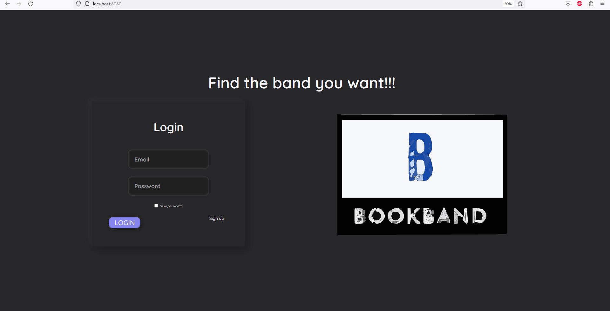
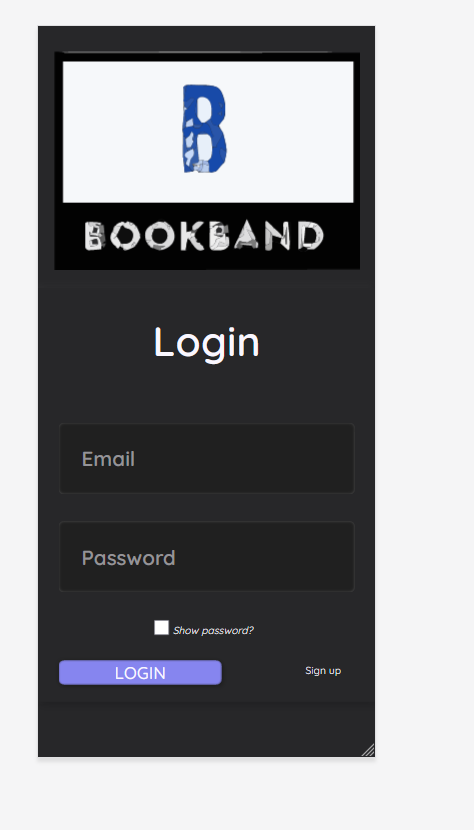
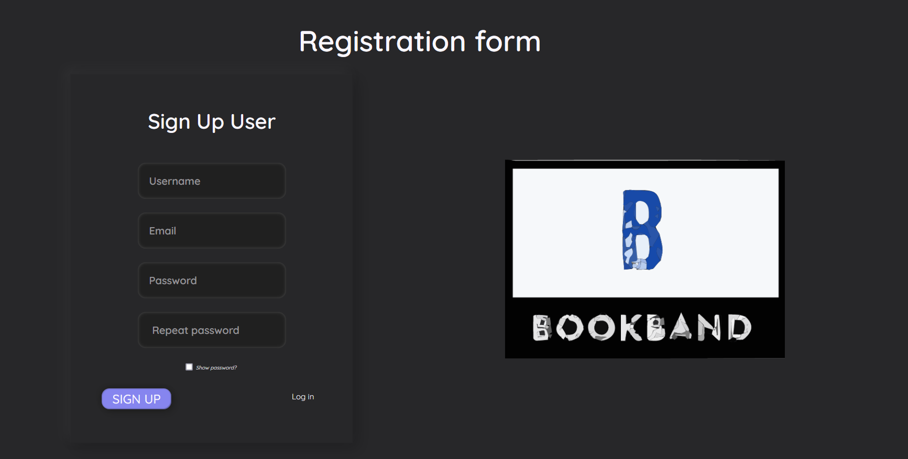
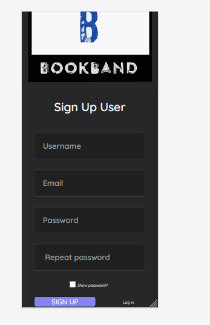
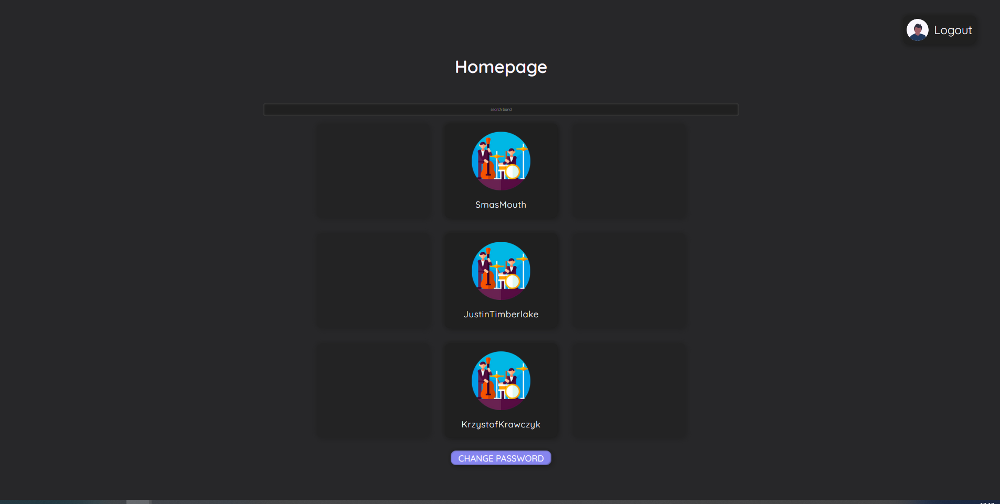
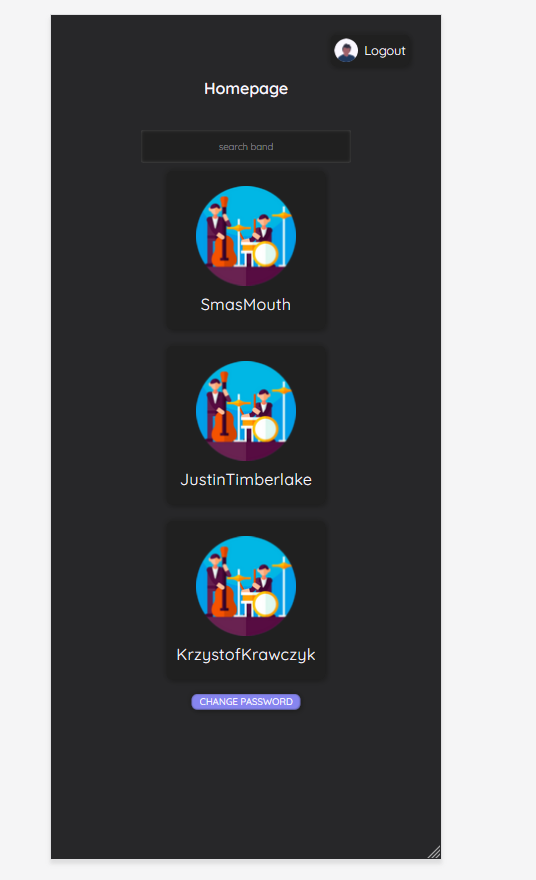
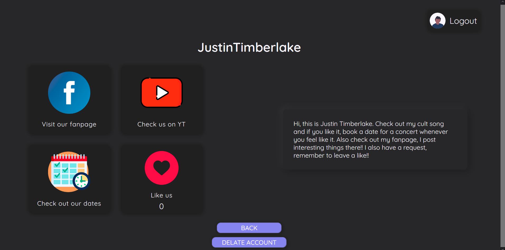
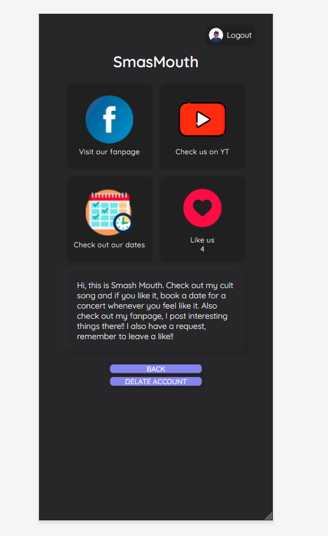
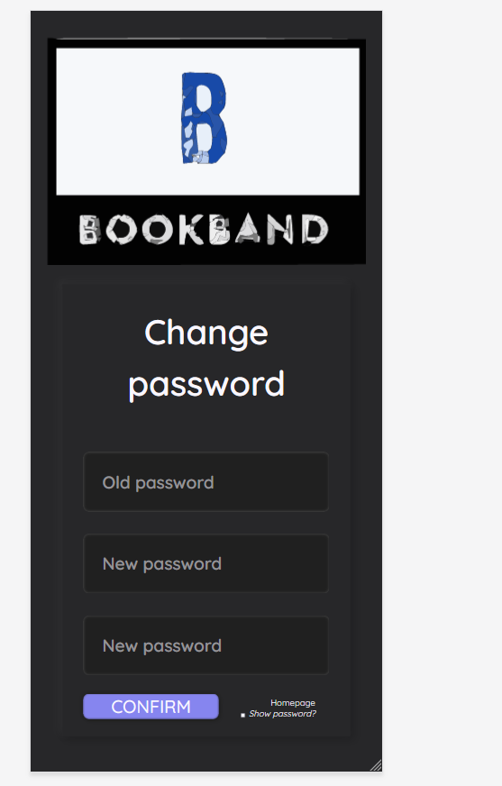

<p align="center">

</p>

# BOOKBAND

A web application where you can book and rate bands from all the world.


# Technologies
- PHP
- JS
- HTML/CSS
- PostgreSQL


# Requirements
- [Docker](https://www.docker.com/)


# Installation

1. Clone the repository from Github:

```
git clone https://github.com/peter20011/PAI_PROJEKT.git
```

2. Create an .env file, which includes database connection details. Do not forget to add this details in constructor in class Database.php.

```
DB_NAME=
DB_USER=
DB_PASSWORD=
DB_HOST=
```

3. Open terminal and run commands:

```
docker-compose build
```

```
docker-compose up
```

4. Access it by visiting http://localhost:8080 in your web browser.


# Database


# SQL SCRIPT
- SQL script available in the folder 'sql_data'

# SCREENSHOTS

- Login
  
  

- Register User
  
  

- Homepage
  
  

- Band Profile
  
  

- Change password
  
  